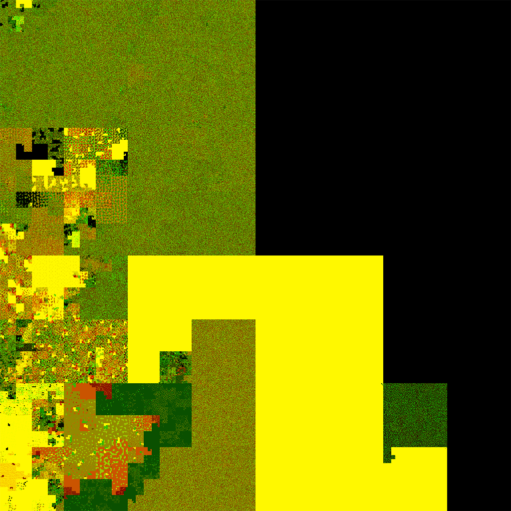

# Memsquare
A C# implementation of Micah Scott (scanlime)'s memsquare memory visualisation technique. It was originally part of the [coastermelt](https://github.com/scanlime/coastermelt) project, and the Python implementation can be found [here](https://github.com/scanlime/coastermelt/blob/master/backdoor/memsquare.py).

## Example
This is a memsquare generated from an uncompressed firmware image.

**Input File Size**: 22,020,096 bytes  
**Memsquare Image Size**: 3,249,087 bytes  
**Block Size**: 8 bytes  
**Red Channel**: Average  
**Green Channel**: Sum (mod 256)  
**Blue Channel**: Zero

### Compressed Image

### [Uncompressed Image](img/big.png)
